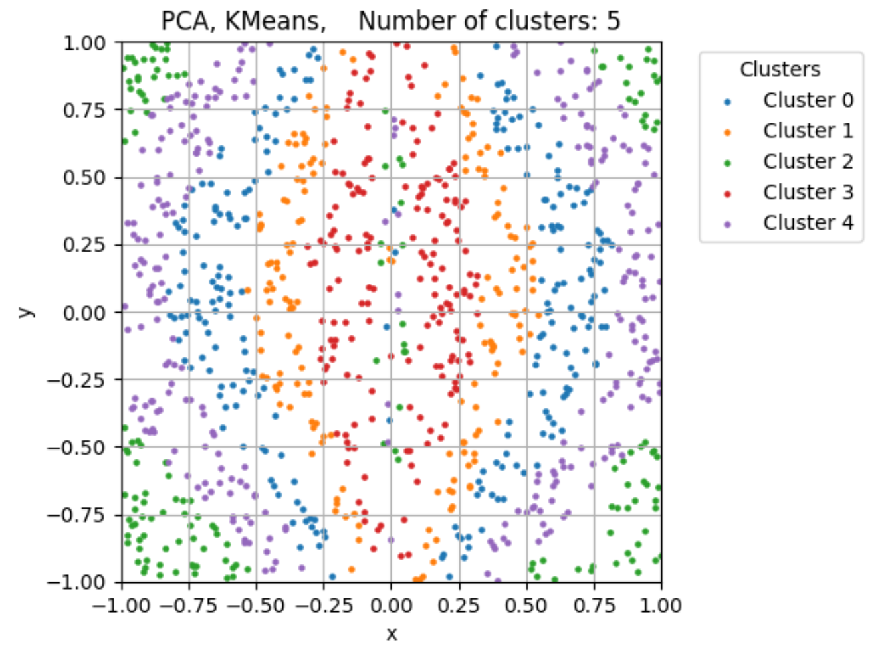
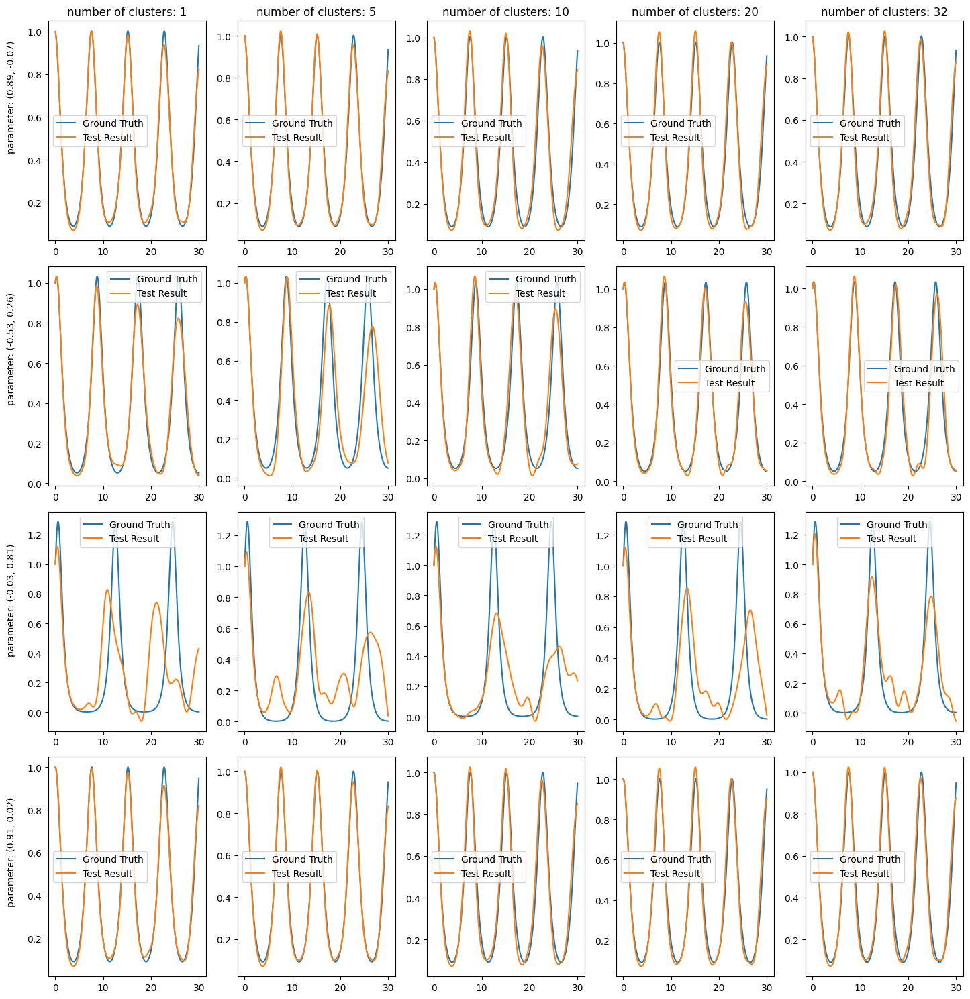

 

This repository is dedicated to reproducing the results of the paper [1]. This repository employs a different method, and the goal is to achieve similar results under the same experimental settings.

 

## 

 

 

 
 

##
Reference:

[1]: Giovanis, D. G., & Shields, M. D. (2020). Data-driven surrogates for high dimensional models using Gaussian process regression on the Grassmann manifold. Computer Methods in Applied Mechanics and Engineering, 370, 113269.